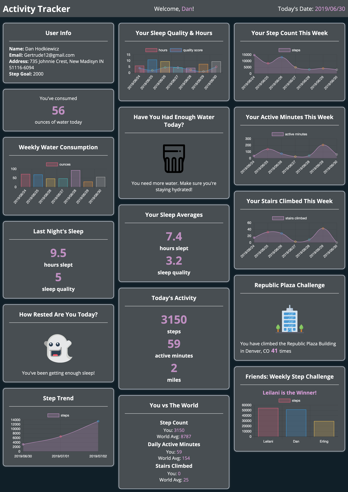
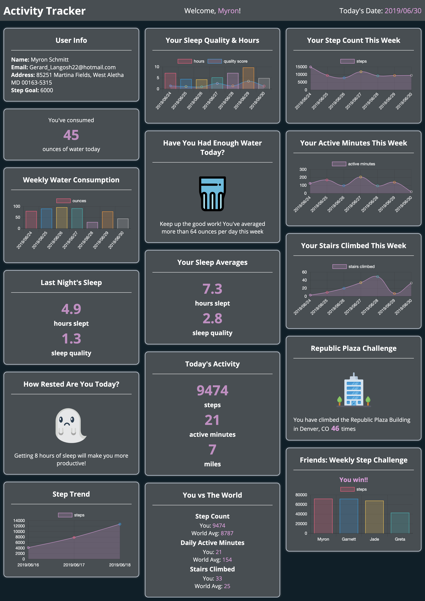
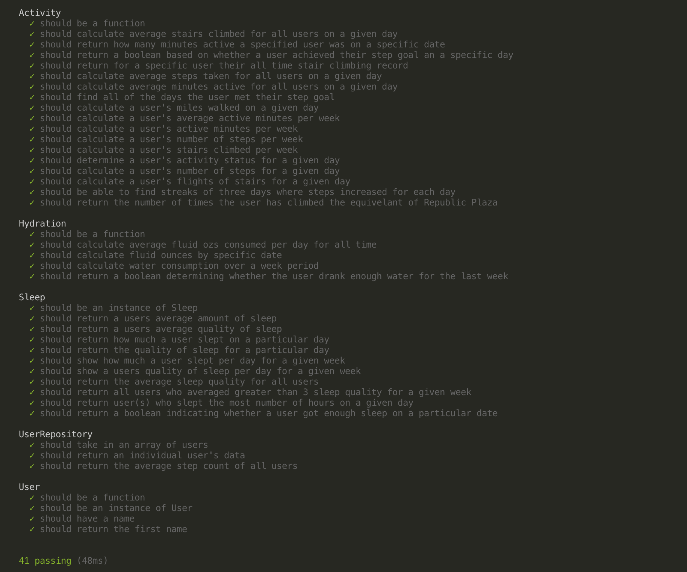

# FitLit
## Created by Elyse Myers & Michael Schneider
### View the live site on Heroku!
### https://ec-myers.github.io/fitlit/src/index.html

## Summary
FitLit is the second project of Module 2 at the Turing School of Software & Design. FitLit is an application that aggregates and displays fitness data for a given user profile. The dataset for this application contains information for each user regarding hydration, activity and sleep. Key information for each of these categories is shown on the browser

This project focuses on data manipulation through the implementation of object and array prototype methods, as well as implementation of a robust testing suite using test driven development(TDD).

## Languages Used

- JavaScript
- CSS
- HTML
- Mocha and Chai testing suite

<<<<<<< HEAD
## Screenshots!

=======
## Screenshots

>>>>>>> 23391fcbd5a468ba35abeb7275c9ae382e87e637
